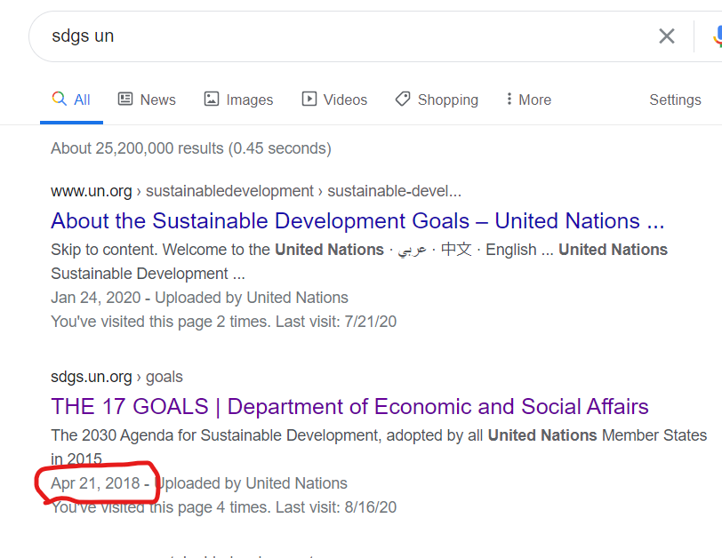

# 小論文の構成について

## 序章
#### 問題提起と論文の目的を示す
1. 現状について記述する
- 例）古来から現在に至るまで、争いは様々な形で行われており、現在も多くの国々で問題となっている。
2. 必要であれば色々定義する
- 例）ここでは争いを国同士、民族同士、人種の争いと定義する。
3. 問題点を述べる
- 例）争いが続いている状況では、世界平和が訪れることはなく、人間の将来に大きな不安をもたらす。
4. 解決策を大まかに挙げて論文の目的を提示する
- 例）そこで本論文では、争いの解決方法として国、民族、人種の側面から争いを無くす方法について論じる。

## 内容
#### 各問題解決策について論じる（２つ～３つくらい）
- 簡単に解決策を提示
  - 第１に、○○の解決策としてＸＸが挙げられる。
- トピックについての問題点を述べる
  - ○○の問題として広く上げられるのは△△であり、特に□□では○○が大きな問題となっている
- トピックについての解決策を紹介
  - そこで、ＸＸを用いることによって～～～を～～～できると考えられる。
- なぜ解決策が有効なのかを説明
  - なぜなら、ＸＸは～～～であり、～～～ということが明らかとなっているためである。
- 文章を締める
  - このような手法を用いることで、問題が解決できると考えられる。

## まとめ
#### 序章を振り返り、説明した内容が論文の目的と問題解決を行っているかを再確認
- 内容をまとめなおす
  - 以上のことから、○○、##、※※を行うことは、～～に対して有効である。
- 問題が解決したことをアピール
  - これらのことを行うことで、～～の問題を解決することが可能であると考えられる。

-----

便利なフレーズ
## 提示する系
- ～～があげられる
- ～～となっている
- ～～が明らかとなっている
- ～～と判明した
- ～～などが考えられる
- ～～と示された
- ～～と提示されている
- ～～の場合が多い

## 明確に明言したくない
- ～～の場合が多い
- ～～が多く
- ～～と考えられる
- ～～の問題は少なくない
- 多くの場合、～

## 強調したい
- ～～が重要である
- ～～が必要不可欠である
- ～～は明白である
- ～～が顕著である
- 特に～～では

## 問題点を述べる
- 世界では～～が大きな問題点となっており、～～があげられる
- しかしながら、～～であり、～～が～～となっている

## つなぎのことば
- よって
- 更に
- そのため・このため
- 以上に加え
- これらのことから
- しかしながら
- また
- 特に

## まとめのことば
- 以上のことから
- これらのことから

------

# 引用方法
## Websiteの引用
### 注意点
- 信頼できるソースを利用する
- できるだけ国際機関や研究機関のソースを利用
- NGOでもOK
- 個人ウェブサイトは利用しない
- ニュースは偏りがあることを理解した上で使用

### 引用方法

著者名. "Webページタイトル". ウェブサイトの名称. サイト作成（更新）日付. URL,(アクセス日)

- コンマ（,）とピリオド（.）に注意すること
- 例） United Nations. "THE 17 GOALS|Department of Economic and Social Affiars". 2018/04/21. https://sdgs.un.org/goals, (アクセス日2020/08/18)
- サイト作成日がわからない場合、**Googleで調べると日付がでてくることがある**。

## 論文の引用
### 注意点
- 見られないことが多い
- 読めないことが多い
- 読んでる暇がない

### 引用方法

著者名. (発行年). "論文タイトル". 雑誌名. 版. p.ページ.

- 単一著者の場合） Yamamoto, T. (1999) "Introduction to Story of Peach-man, Momotaro". Journal of Japanese story. 3. p.10-15.
- 複数著者の場合) Yamada, T., J. Suzuki, and S. Kato. (2020). "Geography of Mount Kachi-kachi". Journal of mythical geography. 11. p. 100-125.
